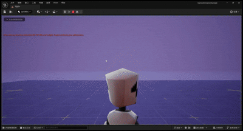
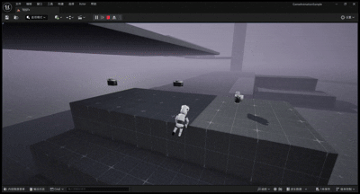
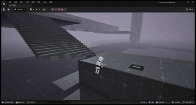
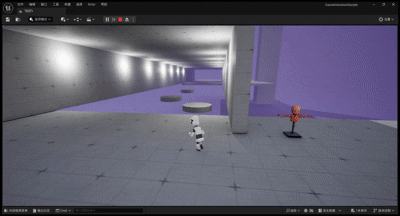
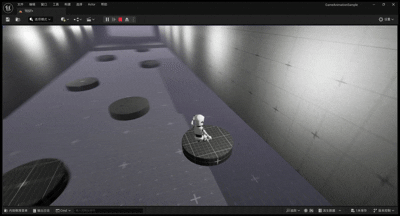
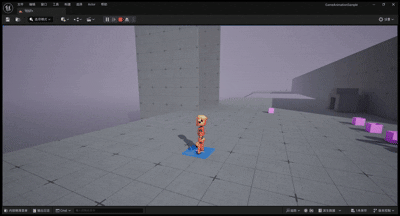
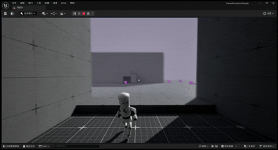

# 第三人称闯关Demo

这个Demo展示了使用虚幻引擎5开发的第三人称闯关游戏，包括平台跳跃、障碍物、机关等元素。

## 功能展示

> 注：此Demo的GIF展示暂未添加，未来将会补充相关内容

### 1.角色动作

  
  
<strong>攀爬动作</strong>

### 2.表里世界切换

  
  
<strong>表里世界切换</strong>

### 3.相机拍摄、投影功能

  
  
<strong>相机拍摄再投影</strong>

### 4.投影出来的物质

  
  
<strong>投影出来的物质</strong>

### 5.利用表里世界特性制造陷阱

  
  
<strong>利用表里世界特性制造陷阱</strong>

### 6.简单的平台移动设计

  
  
<strong>简单的平台移动设计</strong>

### 7.利用表里世界特性保证线性闯关&&传送门

  
  
<strong>利用表里世界特性保证线性闯关</strong>

### 8.特定交互控制其他角色

  
  
<strong>特定交互控制其他角色</strong>

### 9.固定角色位置保持里世界使得电梯通道出现

  
  
<strong>固定角色位置保持里世界使得电梯通道出现</strong>

### 10.角色吸取和发射特定物体能力（某种情况可以使用）

  
  
<strong>角色吸取物体后发射物体，并在吸取未发射时持续跟随</strong>

### 11.利用发射能力实现远程开关

  
  
<strong>利用发射能力实现远程开关启动电梯</strong>

>

## 技术实现

- 使用虚幻引擎5的角色移动系统实现流畅的角色控制和跳跃机制
- 通过蓝图系统实现各类交互式机关和障碍物
- 设计了进度保存和关卡重置机制
- 实现了多种场景元素如移动平台、机关陷阱、收集物等
- 优化了物理碰撞和角色反馈，提供良好的游戏体验

## 关卡设计

- 难度递进的关卡布局
- 多路径探索设计
- 丰富的视觉反馈和引导
- 关卡内置奖励和收集要素

[返回主页](./README.md) 