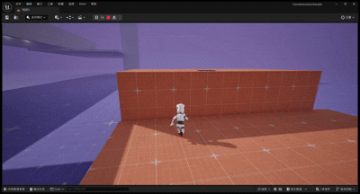
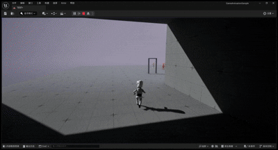

# 第三人称闯关Demo

这个Demo展示了使用虚幻引擎5开发的第三人称闯关游戏，基于"表里世界"双重维度设计，玩家可以在两个平行世界间切换，结合相机拍摄投影、物体操控等创新机制解决谜题。

## 功能展示

### 1.角色动作

  
  
<strong>攀爬动作</strong>

基于高级运动系统，通过UE5的动画重定向功能，使得不同外表、大小的人型骨骼能够自由应用该运动动画，能够进行奔跑、攀爬等功能。

### 2.表里世界切换

  
  
<strong>表里世界切换</strong>

当角色进入某个区域或者打开某个开关时，表里世界进行切换，原本表世界无法看见和触碰的物体能在里世界显现。

### 3.相机拍摄、投影功能

  
  
<strong>相机拍摄再投影</strong>

当角色进入某个区域或者打开某个开关时，表里世界进行切换，原本表世界无法看见和触碰的物体能在里世界显现。

### 4.投影出来的物质

  
  
<strong>投影出来的物质</strong>

投影出来的物质具有实体碰撞，但一旦切换世界就会消失。

### 5.利用表里世界特性制造陷阱

  
  
<strong>利用表里世界特性制造陷阱</strong>

利用表里世界切换特定物质会消失的特点，使玩家在岔路选择时制造陷阱。

### 6.简单的平台移动设计

  
  
<strong>简单的平台移动设计</strong>

### 7.利用表里世界特性保证线性闯关&&传送门

  
  
<strong>利用表里世界特性保证线性闯关</strong>

当玩家达到下一个区域时也利用了表里世界的特性使得闯关能以线性进行。

传送门功能不仅能传送角色，还能通过渲染看到门对面的风景，在特定情况下能开启传送功能可以添加游玩性。（PS:传送门不仅可以传送角色，还可以传送任何设定好的Acotr）

### 8.特定交互控制其他角色

  
  
<strong>特定交互控制其他角色</strong>

玩家可以通过与特定物品交互来控制另一个角色。

### 9.固定角色位置保持里世界使得电梯通道出现

  
  
<strong>固定角色位置保持里世界使得电梯通道出现</strong>

玩家通过控制另一个角色保持里世界的开启，让电梯通道显型

### 10.角色吸取和发射特定物体能力（某种情况可以使用）

  
  
<strong>角色吸取物体后发射物体</strong>

在特定情况下，角色拥有吸取和发射特定物体的能力，并在吸取但未发射时持续跟随

### 11.利用发射能力实现远程开关

  
  
<strong>利用发射能力实现远程开关启动电梯</strong>

玩家可利用发射能力实现远程开关启动电梯

## 技术实现

- 使用虚幻引擎5的角色移动系统实现流畅的角色控制和攀爬机制
- 开发了表里世界切换系统，实现了两个世界的无缝转换和物体状态变化
- 设计了创新的相机拍摄投影系统，允许玩家将拍摄物体具象化
- 实现了角色物体吸取与发射能力，支持远程交互和精确控制
- 开发了角色切换控制系统，支持多角色协作解谜
- 通过蓝图系统实现了复杂的机关、传送门和电梯系统
- 优化了物理碰撞和角色反馈，确保两个世界间切换的流畅体验

## 关卡设计

- 基于表里世界切换的多层次谜题设计
- 通过空间限制和机关布置引导玩家探索世界切换的可能性
- 设计了需要精确投影和物体操控的挑战性谜题
- 创造了需要多角色协作的关卡环节
- 利用表里世界特性设计线性闯关体验和非线性探索空间
- 通过机关和陷阱增加游戏的挑战性
- 巧妙利用移动平台和传送系统丰富游戏的垂直空间设计

[返回主页](./README.md) 