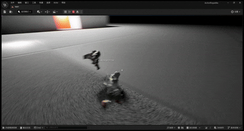
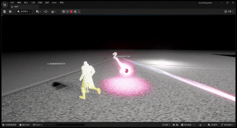
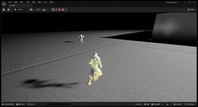

# 第三人称射击Demo

这个Demo展示了使用虚幻引擎5开发的第三人称射击游戏功能，包括射击、瞄准、武器切换等特性。

## 功能展示

### 基础射击

### 武器特效

### 敌人交互

## 技术实现

- 使用虚幻引擎5的角色系统和动画蓝图实现流畅的角色控制
- 通过物理系统实现真实的子弹轨迹和碰撞效果
- 利用粒子系统实现枪口火焰和弹壳等特效
- 实现了武器切换和弹药管理系统
- 基于虚幻引擎的AI系统实现敌人行为

[返回主页](./README.md) 