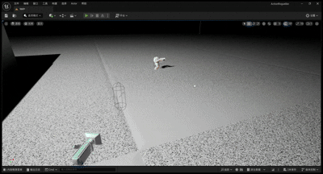
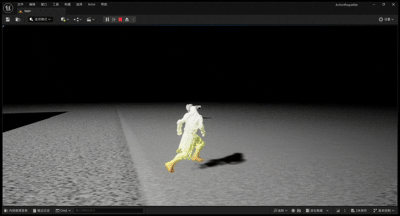
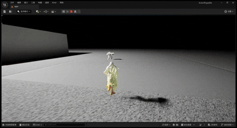
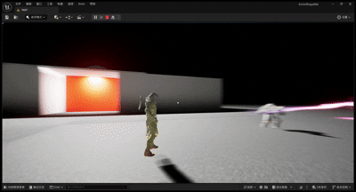

# 第三人称射击Demo

这个Demo展示了使用虚幻引擎5开发的第三人称射击游戏功能，包括角色动作系统、射击、瞄准、锁定追踪等战斗特性，以及完整的敌人AI和互动系统。

## 功能展示

### 1.角色开场动作

  
  
<strong>角色开场登场动作</strong>

### 2.角色行走和瞄准

  
  
<strong>角色行走和瞄准</strong>

### 3.角色奔跑加速

  
  
<strong>角色奔跑加速</strong>

### 4.角色射击动作与特效

  
  
<strong>角色射击动作与特效</strong>

### 5.敌人受击特效以及死亡动画

  
  
<strong>敌人受击特效以及死亡动画</strong>

### 6.敌人AI

  
  
<strong>敌人AI行为树发现并发动攻击</strong>

### 7.朝向锁定

  
  
<strong>朝向锁定敌人</strong>

### 8.锁定攻击并追踪

  
  
<strong>锁定攻击有一定的追踪</strong>

## 技术实现

- 使用虚幻引擎5的角色系统和动画蓝图实现流畅的角色控制与动作表现
- 开发了精确的瞄准系统和射击反馈机制
- 实现了锁定目标系统，支持锁定敌人并追踪攻击
- 设计了角色移动状态系统，包括走路、奔跑加速等不同移动状态
- 通过粒子系统实现枪口火焰、子弹轨迹和环境交互特效
- 开发了敌人AI行为树，实现敌人的发现、追踪和攻击行为
- 实现了敌人受击反馈和死亡动画系统，增强战斗体验
- 优化了角色开场和战斗动作，提升游戏的视觉表现

[返回主页](./README.md) 