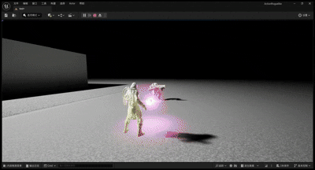

# 第三人称射击Demo

这个Demo展示了使用虚幻引擎5开发的第三人称射击游戏功能，包括射击、瞄准、锁定等特性。

## 功能展示

### 1.角色开场动作

  
  
<strong>角色开场登场动作</strong>

### 2.角色行走和瞄准

  
  
<strong>角色行走和瞄准</strong>

### 3.角色奔跑加速

  
  
<strong>角色奔跑加速</strong>

### 4.角色射击动作与特效

  
  
<strong>角色射击动作与特效</strong>

### 5.敌人受击特效以及死亡动画

  
  
<strong>敌人受击特效以及死亡动画</strong>

### 6.敌人AI

  
  
<strong>敌人AI行为树发现并发动攻击</strong>

### 7.朝向锁定

  
  
<strong>朝向锁定敌人</strong>

### 8.锁定攻击并追踪

  
  
<strong>锁定攻击有一定的追踪</strong>

## 技术实现

- 使用虚幻引擎5的角色系统和动画蓝图实现流畅的角色控制
- 通过物理系统实现真实的子弹轨迹和碰撞效果
- 利用粒子系统实现枪口火焰和弹壳等特效
- 实现了武器切换和弹药管理系统
- 基于虚幻引擎的AI系统实现敌人行为

[返回主页](./README.md) 