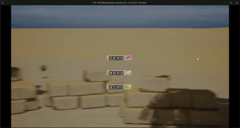
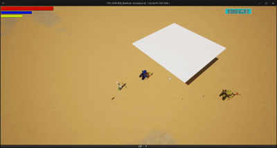
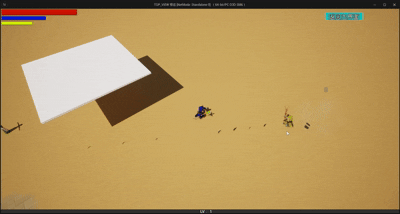
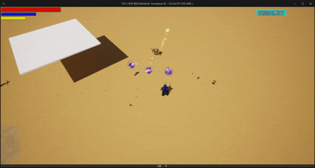
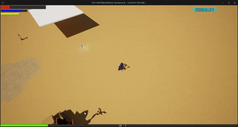
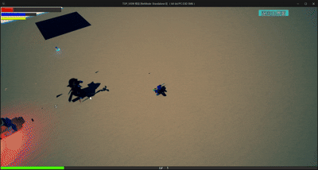
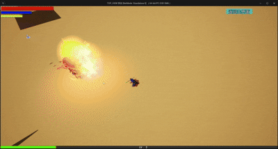

# 俯视角游戏Demo

这个Demo展示了使用虚幻引擎5开发的俯视角游戏，包括点击移动、技能释放、资源管理等要素。

## 功能展示

> 注：此Demo的GIF展示暂未添加，未来将会补充相关内容
### 1.游戏界面

  
  
<strong>游戏界面</strong>

### 2.俯视透视

  
  
<strong>角色开场登场动作</strong>

### 3.敌人AI以及受击效果

  
  
<strong>敌人AI以及受击效果</strong>

### 4.角色受击血量扣除

  
  
<strong>角色受击血量扣除</strong>

### 5.刷怪&&龙卷风技能

  
  
<strong>刷怪&&龙卷风技能</strong>

### 6.流星火雨

  
  
<strong>流星火雨</strong>

### 7.怪物清除进入下个关卡的动画展示

  
  
<strong>怪物清除进入下个关卡的动画展示</strong>

### 8.死亡后存档功能

  
  
<strong>死亡后存档功能</strong>

## 技术实现

- 使用虚幻引擎5的导航网格系统实现点击移动功能
- 通过自定义控制器实现俯视角相机控制和缩放
- 设计了技能系统和冷却机制
- 实现了敌人的AI行为和战斗逻辑
- 开发了资源收集和管理系统

## 游戏特色

- 简洁直观的用户界面
- 多样化的技能系统和角色成长
- 程序化生成的地图元素
- 多样化的敌人类型和行为模式
- 基于资源收集的游戏进程

[返回主页](./README.md) 